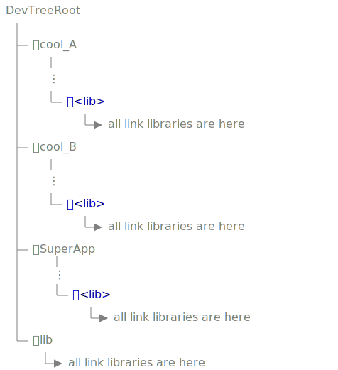
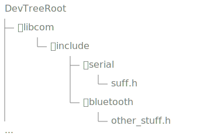

<h1> CPM - A C/C++ Package Manager </h1>

- [1. A Basic Example](#1-a-basic-example)
- [2. Code Layout Rules](#2-code-layout-rules)
  - [2.1. Multi-module library packages](#21-multi-module-library-packages)
  - [2.2. Weak Dependencies](#22-weak-dependencies)
  - [2.3. Compatibility with other code layout schemes](#23-compatibility-with-other-code-layout-schemes)
- [3. Installation](#3-installation)
- [4. Usage](#4-usage)
- [5. Semantics of CPM.JSON file](#5-semantics-of-cpmjson-file)
- [6. Operation](#6-operation)
- [7. Proving Ground](#7-proving-ground)
- [8. Integration with GitHub actions](#8-integration-with-github-actions)
     
CPM is a tool that helps coordinate work between multiple repositories. All you need is a simple JSON file to describe dependencies between repositories. This, together with the magic of symbolic links helps maintain a consistent environment for multiple libraries.

## 1. A Basic Example ##
You have two libraries `cool_A` and `cool_B` that need to be used in an application `super_app`. Both `cool_A` and `cool_B` use code from another library `utils`. Each one for these has its own Git repository.

You need to create a JSON file called `cpm.json` in each repository:

In `super_app`:
````JSON
{ "name": "super_app", "git": "git@github.com:user/super_App.git",
  "depends": [
      {"name": "cool_A", "git": "git@github.com:user/cool_A.git"},
      {"name": "cool_B", "git": "git@github.com:user/cool_B.git"}
  ],
  "build" : [
      {"os": "windows", "command": "msbuild", "args": ["super_app.proj"]},
      {"os": "linux", "command": "cmake"}
  ]
}
````
In `cool_A`:
````JSON
{ "name": "cool_A", "git": "git@github.com:user/cool_A.git",
  "depends": [
      {"name": "utils", "git": "git@github.com:user/utils.git"},
  ],
  "build": [
      {"os": "windows", "command": "msbuild", "args": ["cool_a.proj"]},
      {"os": "linux", "command": "cmake"}
  ]
}
````

In `cool_B`:
````JSON
{ "name": "cool_B", "git": "git@github.com:user/cool_B.git",
  "depends": [
      {"name": "utils", "git": "git@github.com:user/utils.git"},
  ],
  "build": [
      {"os": "windows", "command": "msbuild", "args": ["cool_b.proj"]},
      {"os": "linux", "command": "cmake"}
  ]
}
````

In `utils`:
````JSON
{ "name": "utils", "git": "git@github.com:user/utils.git",
  "build": [
      {"os": "windows", "command": "msbuild", "args": ["utils.proj"]},
      {"os": "linux", "command": "cmake"}
  ]
}
````

After that, you just have to fetch the `super_app` repository and invoke the CPM utility:
````
cpm super_app
````
It will take care of pulling all the other repositories and issuing the build commands for the current operating system.

## 2. Code Layout Rules ##
To be able to use this magic you have to adhere to a set of basic rules:
> **RULE 1** - All projects have their own folder and all project folders are in one parent folder. The environment variable `DEV_ROOT` points to this root of development tree.

Here is a diagram showing the general code layout:


> **RULE 2** - Include files that need to be visible to users are placed in a subfolder of the `include` folder. The subfolder has the same name as the library.

Users of `cool_A` can refer to `hdr1.h` file like this:
````C
#include <cool_A/hdr1.h>
````
An additional advantage of this organization is that it prevents name clashes between  different libraries. In this case, if a program uses both `cool_A` and `cool_B`, the corresponding include directives will be:
````C
#include <cool_A/hdr1.h>
#include <cool_B/hdr1.h>
````
<u>**Note:**</u> There is an enhancement to this rule: if the library package contains separate groups of files, they can be grouped together in *modules*. See below about multi-module libraries. Usually however, a library package has only one module.

> **RULE 3** - Include folders of dependent modules are made visible through symbolic links

In the structure shown before, the application that uses `cool_A` and `cool_B` will have an `include` folder but in this folder there are _symbolic links_ to `cool_A` and `cool_B` include folders. The folder structure will look something like this (angle brackets denote symbolic links):


> **RULE 4** - All binary library packages reside in a `lib` folder at the root of development tree. Each package contains a _symbolic link_ to this folder.

Without repeating the parts already shown of the files layout, here is the part related to `lib` folder (again, angle brackets denote symbolic links):



If there are different flavors of link libraries (debug, release, 32-bit, 64-bit) they can be accommodated as subfolders of the `lib` folder.

### 2.1. Multi-module library packages ###
Sometimes, a library may contain more than one group of files. For instance a communication library may contain a group of functions for serial communication, another for Bluetooth communication, and so on. We call these groups of files *modules*. In this case, the header files can be divided in different folders, one for each module in the library:



 Inside the library, the headers can be referenced as:
```C++
#include <serial/stuff.h>
#include <bluetooh/other_stuff.h>
```
If a dependent package wants to include only one module of the library, it can use the `modules` attribute in the dependency descriptor.

Example:
````JSON
  "depends": [
      {"name": "libcom", "modules": ["serial"], "git": "git@github.com:user/mml.git"}]
````
This will produce the following folder structure (again, angle brackets denote symbolic links):  


It is OK to refer more than one module:
````JSON
  "depends": [
      {
        "name": "libcom",  
        "git": "git@github.com:user/mml.git", 
        "modules": ["serial", "bluetooth"]
      },
````

Note that a library package with multiple modules still has only one binary `.lib` (or `.a`) file.

### 2.2. Weak Dependencies ###
Sometimes it may happen that two modules are interdependent. For instance `cool_A` needs a type definition that is provided by `cool_B`. Symbolic links can take care of this situation like shown below:


In such cases, CPM has to fetch the packages and create the symbolic links but should not initiate the build process of `cool_B` as part of the build process for `cool_A`. These situations are called *weak dependencies* and are flagged by the `fetchOnly` flag in the CPM.JSON file.

### 2.3. Compatibility with other code layout schemes ###
The layout required by CPM is simple and, as such, very compatible with other layout recommendations. My personal favorite is [The Pitchfork Layout](https://api.csswg.org/bikeshed/?force=1&url=https://raw.githubusercontent.com/vector-of-bool/pitchfork/spec/data/spec.bs). Note however the following differences:
- PFL does not describe any mechanism for cooperation between different packages. The symbolic links mechanism described in this document is specific to CPM.
- PFL does not use a shared `lib/` directory. The PFL `libs/` folder is used for a different purpose.

## 3. Installation ##
CPM is written in Go. You can download a prebuilt version for [Windows](https://github.com/neacsum/cpm/releases/latest/download/cpm.exe) or [Ubuntu](https://github.com/neacsum/cpm/releases/latest/download/cpm). Alternatively, you can build it from source. To build it, you need to have the Go compiler [installed](https://go.dev/doc/install). Use the following command to build the executable:
````
go build cpm.go
````
There are no other dependencies and you just have to place the CPM executable somewhere on the path.

## 4. Usage ##
````
cpm [options] [project]
````
or
````
cpm version
````

If `project` is not specified, it is assumed to be in the current directory.

Valid options are:
  - `-b <branch_name>` switches to a specific branch
  - `-F` discards local changes when switching branches (issues a `git switch -f ...` command)
  - `-f` fetch-only (no build)
  - `-l` local-only (no pull)
  - `--proto [git | https]` preferred protocol for package cloning 
  - `-r <folder>` set root of development tree, overriding `DEV_ROOT` environment variable
  - `-v` verbose

## 5. Semantics of CPM.JSON file ##
|Level | Attribute   | Value  | Semantics |
|------|-------------|--------|-----------|
| 1    | `name`      | string | Name of package |
| 1    | `git`       | string | Download location for the package using _git_ protocol |
| 1    | `https`     | string | Download location for the package using _https_ protocol |
| 1    | `build`     | array  | Commands to be issued for building the package. |
| 2    | `os`        | string | OS to which the build command applies |
| 2    | `command`   | string | Command issued for building the package |
| 2    | `args`      | array  | Command arguments |
| 1    | `depends`   | array  | Package dependencies |
| 2    | `name`      | string | Name of dependency |
| 2    | `git`       | string | Download location for dependency using _git_ protocol |
| 2    | `https`     | string | Download location for dependency using _https_ protocol |
| 2    | `modules`   | array  | Module names for packages with multiple modules |
| 2    | `fetchOnly` | bool   | Weak dependency (see below) |

## 6. Operation ##
CPM reads the CPM.JSON file in the selected folder and, for each dependent package, it checks if the project folder exists. If not, it issues a `git clone` command to bring the latest version. If you have selected a specific branch, CPM issues a `git switch ...` command to switch to that branch and then a `git pull ...` command to bring in the latest version of that branch.

The next step is to build build each package by issuing the build commands appropriate for the OS environment. All commands that have an `os` attribute matching the current OS or without any `os` attribute are issued in order.

## 7. Proving Ground ##
CPM can be tested using a [sample project](https://github.com/neacsum/example_super_app). To use it, follow these steps:
1. Make sure you have installed Visual Studio 2017 or higher (preferably VS2022).
2. Download [CPM](https://github.com/neacsum/cpm/releases/latest/download/cpm.exe) program and place it somewhere in the path
3. Create a `devroot` folder:
````
c:\temp>mkdir devroot
c:\temp>set DEV_ROOT=c:temp\devroot
c:\temp>cd devroot
````
4. Clone the sample project:  
````
c:\temp\devroot>git clone git@github.com:neacsum/example_super_app.git super_app
````
5. Run the CPM program:
````
c:\temp\devroot>cpm super_app
````
If all goes well, you should have a file `c:\temp\devroot\super_app\build\app\x64\Debug\super_app.exe`. Also the directory `c:\temp\devroot\lib\x64\Debug` should contain the files
- `cool_A.lib`,
- `cool_B.lib`
- `multi_mod.lib`

## 8. Integration with GitHub actions ##
CPM can be integrated with GitHub actions. You only need to fetch the CPM program and run it. Below is an example pulled from the same proving ground application:
```yaml
name: Build
on:
  push:
    branches: [ "main" ]
  pull_request:
    branches: [ "main" ]

permissions:
  contents: read

env:
  # This is the destination directory for CPM tool
  USERPROFILE: .
  
jobs:
  build:
    runs-on: windows-latest
    
    steps:      
      - name: Get CPM
        uses: engineerd/configurator@v0.0.8
        with:
          name: cpm.exe
          url: https://github.com/neacsum/cpm/releases/latest/download/cpm.exe
      
      - name: Clone
        run: git clone https://github.com/neacsum/example_super_app.git .\super_app

      - name: Build
        run: cpm -v --proto https -r . super_app
        
      - name: Run app
        run: .\super_app\build\app\x64\Debug\super_app.exe
```
It uses an action to [fetch](https://github.com/marketplace/actions/engineerd-configurator) the CPM executable, clones the repo to be built and invokes CPM to build it.

Note that the CPM command specifies the `--proto https` option. Using HTTPS protocol bypasses user authentication problems.
